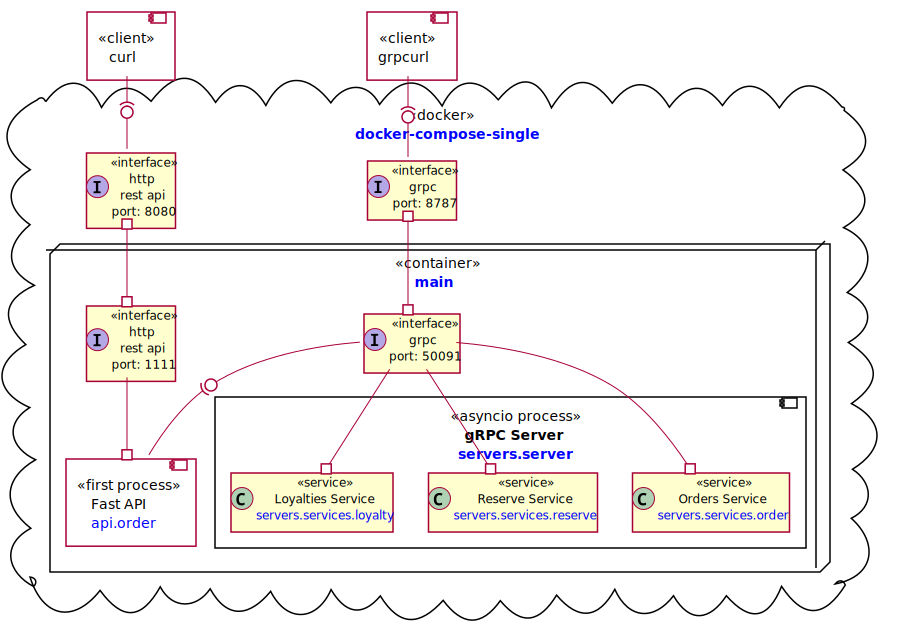
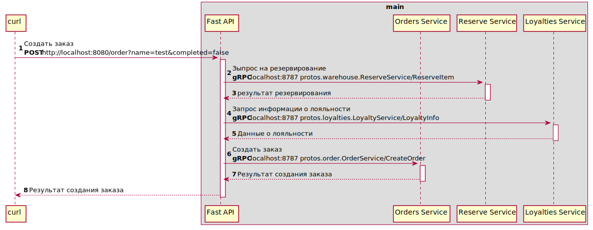
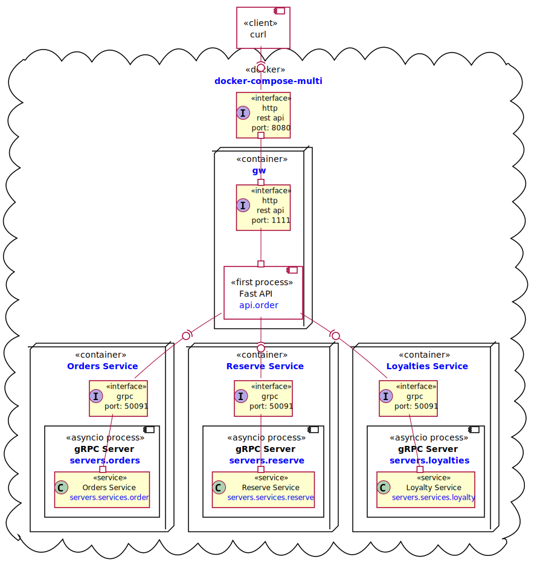
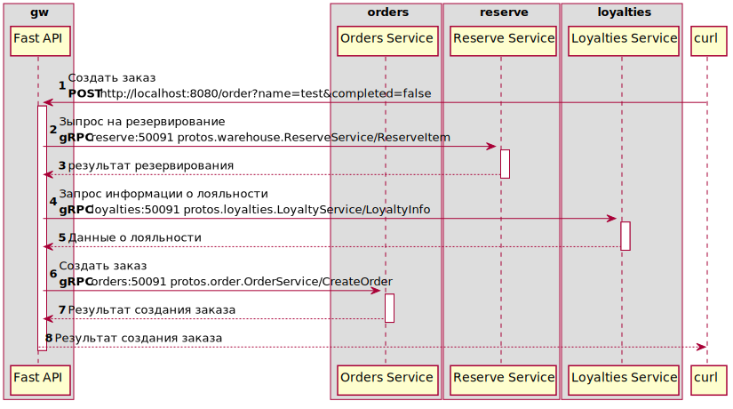

# Один микросервис - один контейнер. День 1

Это первая статья о том, как идея проходит путь от прототипа до полноценного продукта — с участием архитектуры на каждом шагу. Формат — ADR (Architecture Decision Records): каждое решение зафиксировано по дням, чтобы показать реальную эволюцию проекта. Продукт вымышленный, проблемы — настоящие. Те самые, с которыми сталкиваются архитекторы и команды. Документация и код — в открытом доступе на [GitHub](https://github.com/arootcom/grpc-fastapi).

## Контекст

Идет процесс разработки [прототипа](https://github.com/arootcom/grpc-fastapi/tree/day1) на Python, который состоит из трех gRPC микросервисов (заказы, резервирование и лояльность) и API шлюз с последовательным вызовом методов резервирования товаров, применения лояльности и сохранение данных о заказе. [Приложение](https://github.com/arootcom/grpc-fastapi/blob/main/docker-compose-singl.yaml) запускает связанные микросервисы как отдельные процессы используя библитеку [asyncio](https://docs.python.org/3/library/asyncio.html) асинхронного программирования. 
Все это упаковано в один контейнер. Микросервисы независимые, ошибки в одном сервисе могут потянуть за собой цепочку проблем в других, то это может привести к проблемам маштабируемости, отказоустойчивости, мониторинге и безопастности. 



### Запуск прототипа

Что бы запустить прототип необходимо в первую очередь собрать образ контейнера, для этого выполните следущие действия:

1. Склонировать репозиторий проекта

```
$ git clone git@github.com:arootcom/grpc-fastapi.git
$ cd ./grpc-fastapi
```

2. Переключиться на ветку day1

```
$ git remote update
$ git checkout -b day1 origin/day1
$ git pull
```

Если все выполнено верно, то при просмотре списка локальных веток будет следущий результат, где рабочая ветка будет помечена знаком *

```
$ git branch
* day1
  main
```

3. Собрать образ контейнера pyton3-grpc

```
$ docker build -t python3-grpc .
```

Список доступных, локально собранных, образов должен обязательно содержать две записи

```
$ docker images
REPOSITORY     TAG       IMAGE ID       CREATED        SIZE
python3-grpc   latest    1c1383197816   45 hours ago   1.25GB
python         3         4db51a7249e1   2 weeks ago    1.12GB
```

4. Теперь все готово для зауска

```
$ docker-compose -f docker-compose-signl.yaml up
main  | 2025-12-19 09:26:34.346 | INFO     | servers.server:__init__:42 - Enable reflation server
main  | 2025-12-19 09:26:34.354 | INFO     | servers.server:register:48 - Register: Order Service
main  | 2025-12-19 09:26:34.354 | INFO     | servers.server:register:50 - Register: Reserve Service
main  | 2025-12-19 09:26:34.354 | INFO     | servers.server:register:52 - Register: Loyalty Service
main  | 2025-12-19 09:26:34.354 | INFO     | servers.server:run:58 - *** Сервис gRPC запущен: 0.0.0.0:50091 ***
```

Сервис main запускается вызовом команды ```python main.py``` (см. файл [main.py](https://github.com/arootcom/grpc-fastapi/blob/day1/app/main.py)). Для управления контейнерами в приложении используется [docker-compose](https://docs.docker.com/compose/). Праметры окружения описаны в файле [docker-componse-singl.yaml](https://github.com/arootcom/grpc-fastapi/blob/day1/docker-compose-singl.yaml)

```yaml
version: '3.8'
name: "grpc-fastapi-singl"
services:
  main:
    container_name: main
    image: python3-grpc
    volumes:
      - "./app:/usr/src/app"
    environment:
      - GRPC_HOST_ORDERS=0.0.0.0
      - GRPC_HOST_LOYALTIES=0.0.0.0
      - GRPC_HOST_RESERVE=0.0.0.0
      - GRPC_HOST_LOCAL=0.0.0.0
      - GRPC_PORT=50091
      - SERVICE_PORT=1111
      - SERVICE_HOST_LOCAL=0.0.0.0
    ports:
      - "8080:1111"
      - "8787:50091"
    command: "python main.py"
```

Enable reflation server - это сервис, который позволяет клиентам динамически обнаруживать сервисы и их методы на сервере gRPC во время выполнения. Работает по протоколу gRPC Server Reflection Protocol для обнаружения сервисов. Инициализация реализована в [singleton](https://habr.com/ru/companies/otus/articles/779914/) классе [servers.server](https://github.com/arootcom/grpc-fastapi/blob/day1/app/servers/server.py) , который гарантирует, что у класса будет только один экземпляр.

```python
from loguru import logger
from grpc import aio
from grpc_reflection.v1alpha import reflection
    
[skip]

    def __init__(self) -> None:
        if not hasattr(self, 'initialized'):
           self.SERVER_ADDRESS = f'{os.environ["GRPC_HOST_LOCAL"]}:{os.environ["GRPC_PORT"]}'
            self.server = aio.server(ThreadPoolExecutor(max_workers=10))
            self.server.add_insecure_port(self.SERVER_ADDRESS)

            SERVICE_NAMES = (
                order_pb2.DESCRIPTOR.services_by_name["OrderService"].full_name,
                reserve_pb2.DESCRIPTOR.services_by_name["ReserveService"].full_name,
                loyalty_pb2.DESCRIPTOR.services_by_name["LoyaltyService"].full_name,
                reflection.SERVICE_NAME,
            )
            reflection.enable_server_reflection(SERVICE_NAMES, self.server)
            logger.info(f'Enable reflation server')

            self.initialized = True
[skip]
```

После инициализации выполнена регистрация доступных сервисов в данном экземпляре сервера и его запуск

```python
[skip]

    def register(self) -> None:
        order_pb2_grpc.add_OrderServiceServicer_to_server(OrderService(), self.server)
        logger.info(f'Register: Order Service')
        reserve_pb2_grpc.add_ReserveServiceServicer_to_server(ReserveService(), self.server)
        logger.info(f'Register: Reserve Service')
        loyalty_pb2_grpc.add_LoyaltyServiceServicer_to_server(LoyaltyService(), self.server)
        logger.info(f'Register: Loyalty Service')

    async def run(self) -> None:
        self.register()
        await self.server.start()
        logger.info(f'*** Сервис gRPC запущен: {self.SERVER_ADDRESS} ***')
        await self.server.wait_for_termination()

[skip]
```

### Исследование прототипа

1. Просмотр запущенных контейнеров

```
$ docker ps 
CONTAINER ID   IMAGE          COMMAND            CREATED      STATUS      PORTS                                                                                        NAMES
0064b53278c2   python3-grpc   "python main.py"   4 days ago   Up 3 days   0.0.0.0:8080->1111/tcp, [::]:8080->1111/tcp, 0.0.0.0:8787->50091/tcp, [::]:8787->50091/tcp   main

```

Видим один запущенный контейнер с именем (колонка NAMES) main. Два порта определенные в контейнере проброщены на порты localhost, как показано на схеме выше. Порт 8080 принимает запросы по [http](https://ru.wikipedia.org/wiki/HTTP), а 8787 по [gRPC](https://ru.wikipedia.org/wiki/GRPC)

2. REST API запрос создания заказа

Используем для запроса утилиту командрой строки [curl](https://ru.wikipedia.org/wiki/CURL) 

```
$ curl -X 'POST' 'http://localhost:8080/order?name=test&completed=false' -H 'accept: application/json'
``` 

Результат обработки запроса

```json
{
  "notificationType": "ORDER_NOTIFICATION_TYPE_ENUM_OK",
  "order": {
    "uuid": "9841d6f7-69df-4986-b837-65c386acb41d"
  }
}
```



В консоле, где запушен docker-compose, видим логи - последовательные записи о вызовах и результатах работы, связанных бизнес логикой, микросервисах.

Получение входящего запроса и запрос на резервирование

```
main  | INFO:     172.22.0.1:56680 - "POST /order?name=test&completed=false HTTP/1.1" 200 OK
main  | 2025-12-22 09:26:56.083 | INFO     | servers.services.reserve:ReserveItem:16 - Received request is for reserve item: uuid='5f23a419-3a68-4c6a-87a9-d14f9f021a64' quantity=10
main  | 2025-12-22 09:26:56.083 | SUCCESS  | servers.handlers.reserve:reserve_item:12 - Reserved item: {'uuid': '5f23a419-3a68-4c6a-87a9-d14f9f021a64', 'name': 'asdf', 'instock': 3, 'reserve': 10}
main  | 2025-12-22 09:26:56.084 | DEBUG    | servers.services.reserve:ReserveItem:20 - Result reserve item: notificationType='RESERVE_NOTIFICATION_TYPE_ENUM_OK' item=Item(uuid='5f23a419-3a68-4c6a-87a9-d14f9f021a64', name='asdf', instock=3, reserve=10)
```

Запрос информации о лояльности

```
main  | 2025-12-22 09:26:56.086 | INFO     | servers.services.loyalty:LoyaltyInfo:16 - Received request is for loyalty info: uuid='5f23a419-3a68-4c6a-87a9-d14f9f021a64' quantity=10
main  | 2025-12-22 09:26:56.086 | SUCCESS  | servers.handlers.loyalty:loyalty_info:10 - Loyalty info: {'uuid': '5f23a419-3a68-4c6a-87a9-d14f9f021a64', 'persent': 10}
main  | 2025-12-22 09:26:56.086 | DEBUG    | servers.services.loyalty:LoyaltyInfo:20 - Result loyalty info: notificationType='LOYALTY_NOTIFICATION_TYPE_ENUM_OK' loyalty=Loyalty(uuid='5f23a419-3a68-4c6a-87a9-d14f9f021a64', persent=10)
```

Создание заказа

```
main  | 2025-12-22 09:26:56.089 | INFO     | servers.services.order:CreateOrder:25 - Received request is for create order: uuid='9841d6f7-69df-4986-b837-65c386acb41d' name='test' completed=False date='2025-12-19 09:26:34.311752Z'
main  | 2025-12-22 09:26:56.104 | SUCCESS  | servers.handlers.order:create_order:8 - Created order: [{'uuid': '9841d6f7-69df-4986-b837-65c386acb41d'}]
main  | 2025-12-22 09:26:56.104 | DEBUG    | servers.services.order:CreateOrder:29 - Result created order: notificationType='ORDER_NOTIFICATION_TYPE_ENUM_OK' order=OrderResponse(uuid='9841d6f7-69df-4986-b837-65c386acb41d', name=None, completed=False, date=None)
```

3. Исследуем gRPC сервисы, методы, модели и вызовы

Используем утилиту командной строки [grpcurl](https://habr.com/ru/companies/vdsina/articles/563872/)

Просмотр обслуживаемых микросервисов

```bash
$ grpcurl -plaintext localhost:8787 list
grpc.reflection.v1alpha.ServerReflection
protos.loyalties.LoyaltyService
protos.order.OrderService
protos.warehouse.ReserveService
```

Просмотр методов микросервиса

```bash
$ grpcurl -plaintext localhost:8787 list  protos.order.OrderService
protos.order.OrderService.CreateOrder
```

Просмотр модели запроса

```bash
$ grpcurl -plaintext localhost:8787 describe protos.order.CreateOrderRequest
protos.order.CreateOrderRequest is a message:
message CreateOrderRequest {
  string name = 1;
  bool completed = 2;
  string date = 3;
}
```

Создание заказа

```bash
$ grpcurl -plaintext -d '{"name":"first"}' localhost:8787 protos.order.OrderService/CreateOrder
{
  "notificationType": "ORDER_NOTIFICATION_TYPE_ENUM_OK",
  "order": {
    "uuid": "0eca9a0f-a52a-4d76-b9f8-375d3387c143"
  }
}
```

> [!CAUTION]
> Видим по логам, что при прямом вызове gRPC, происходит прямое резервирование, без учета бизнес логики проверки остатков и применение лояльности.
> Это означает, что при прямом доступе нет гарантии атомарности операции - завершения всех шагов, либо ни одного.

## Решение

Каждый микросервис оформить в отдельный контейнер. Это позволит изолировать сервис, обеспечить независимость в развертывании и маштабировании.

1. Минимизация размера. Контейнер содержит только необходимые зависимости и код, что упрощает управление ресурсами.
2. Эффективное масштабирование. Каждый микросервис может быть масштабирован независимо от других, обеспечивая оптимальное распределение нагрузки.
3. Упрощённое обновление и управление. Изменения в одном микросервисе не требуют пересоздания всех контейнеров.
4. Гибкое управление зависимостями и версиями. Различные версии микросервисов могут существовать параллельно, не влияя на работу других сервисов.



Внесены следущие изменения:

1. Прямой вызов gRPC до микросервисов заказа, резервировани и лояльности заблокирован.
2. Вызовы только через API Gateway по REST API
3. Контейнер main декомпозирован на четыре:
    * gw - микросервис оркестратор, содержит бизнес логику создания заказа  
    * oreders service - микросервис управления заказами
    * reserve service - микросервис упраление резервированием данных заказа
    * loyalty service - микросервис данными о лояльности

### Запуск измененного прототипа

> [!IMPORTANT]
>
> Выполнены условия:
>
> 1. Репозиторий проекта склонирован
> 2. Выбрана ветка day1
> 3. Образ контейнера pyton3-grpc собран
>

1. Запуск проекта 

```
$ docker-compose -f ./docker-compose-multi.yaml up
[+] Running 4/0
 ⠿ Container gw         Created
 ⠿ Container loyalties  Created
 ⠿ Container orders     Created
 ⠿ Container reserve    Created
Attaching to gw, loyalties, orders, reserve
reserve    | 2025-12-22 12:23:20.786 | INFO     | servers.reserve:__init__:31 - Enable reflation server
reserve    | 2025-12-22 12:23:20.786 | INFO     | servers.reserve:register:37 - Register: Reserve Service
reserve    | 2025-12-22 12:23:20.786 | INFO     | servers.reserve:run:42 - *** Сервис Reserve gRPC запущен: reserve:50091 ***
loyalties  | 2025-12-22 12:23:20.833 | INFO     | servers.loyalties:__init__:31 - Enable reflation server
loyalties  | 2025-12-22 12:23:20.834 | INFO     | servers.loyalties:register:37 - Register: Loyalty Service
loyalties  | 2025-12-22 12:23:20.834 | INFO     | servers.loyalties:run:42 - *** Сервис Loyalties gRPC запущен: loyalties:50091 ***
orders     | 2025-12-22 12:23:20.952 | INFO     | servers.orders:__init__:32 - Enable reflation server
orders     | 2025-12-22 12:23:20.959 | INFO     | servers.orders:register:38 - Register: Order Service
orders     | 2025-12-22 12:23:20.960 | INFO     | servers.orders:run:44 - *** Сервис Orders gRPC запущен: orders:50091 ***
gw         | INFO:     Will watch for changes in these directories: ['/usr/src/app']
gw         | INFO:     Uvicorn running on http://0.0.0.0:1111 (Press CTRL+C to quit)
gw         | INFO:     Started reloader process [1] using StatReload
gw         | INFO:     Started server process [8]
gw         | INFO:     Waiting for application startup.
gw         | INFO:     Application startup complete.
```

По логам видим, что запустилось четыре контейнера, которые описаны в файле [docker-compose-multi.yaml](https://github.com/arootcom/grpc-fastapi/blob/day1/docker-compose-multi.yaml)
Скрипты для запуска контейнеров размещены в директори проекта [app/](https://github.com/arootcom/grpc-fastapi/tree/day1/app/) и соответстствуют именанам контейнеров:

* [gw.py](https://github.com/arootcom/grpc-fastapi/blob/day1/app/gw.py)
* [loyalties.py](https://github.com/arootcom/grpc-fastapi/blob/day1/app/loyalties.py)
* [orders.py](https://github.com/arootcom/grpc-fastapi/blob/day1/app/orders.py)
* [reserve.py](https://github.com/arootcom/grpc-fastapi/blob/day1/app/reserve.py)

### Исследование измененного прототипа

1. Просмотр запущенных контейнеров

```
$ docker ps 
CONTAINER ID   IMAGE          COMMAND                 CREATED      STATUS             PORTS                                         NAMES
bde2a383c5f7   python3-grpc   "python orders.py"      5 days ago   Up About an hour                                                 orders
18a6bd24b3a4   python3-grpc   "python loyalties.py"   5 days ago   Up About an hour                                                 loyalties
0e5972f9928e   python3-grpc   "python reserve.py"     5 days ago   Up About an hour                                                 reserve
5dc86b298da5   python3-grpc   "python gw.py"          5 days ago   Up About an hour   0.0.0.0:8080->1111/tcp, [::]:8080->1111/tcp   gw
```

Видим четыре запущенных контейнера. Один порт определенный в контейнере gw проброщен на порт localhost, как показано на схеме выше. Порт 8080 принимает запросы по [http](https://ru.wikipedia.org/wiki/HTTP).

2. REST API запрос создания заказа

Используем для запроса утилиту командрой строки [curl](https://ru.wikipedia.org/wiki/CURL) 
Сам запрос не поменялся.

```
$ curl -X 'POST' 'http://localhost:8080/order?name=test&completed=false' -H 'accept: application/json'
``` 

Результат обработки запроса

```json
{
  "notificationType": "ORDER_NOTIFICATION_TYPE_ENUM_OK",
  "order": {
    "uuid": "9841d6f7-69df-4986-b837-65c386acb41d"
  }
}
```

А вот логи и адреса вызовов поменялись. Теперь каздый запрос идет в отдельный контейнер




Получение входящего запроса

```
gw         | INFO:     172.20.0.1:57392 - "POST /order?name=test&completed=false HTTP/1.1" 200 OK
```

Запрос на резервирование

```
reserve    | 2025-12-22 13:54:52.486 | INFO     | servers.services.reserve:ReserveItem:16 - Received request is for reserve item: uuid='5f23a419-3a68-4c6a-87a9-d14f9f021a64' quantity=10
reserve    | 2025-12-22 13:54:52.486 | SUCCESS  | servers.handlers.reserve:reserve_item:12 - Reserved item: {'uuid': '5f23a419-3a68-4c6a-87a9-d14f9f021a64', 'name': 'asdf', 'instock': 3, 'reserve': 10}
reserve    | 2025-12-22 13:54:52.486 | DEBUG    | servers.services.reserve:ReserveItem:20 - Result reserve item: notificationType='RESERVE_NOTIFICATION_TYPE_ENUM_OK' item=Item(uuid='5f23a419-3a68-4c6a-87a9-d14f9f021a64', name='asdf', instock=3, reserve=10)
```

Запрос информации о лояльности

```
loyalties  | 2025-12-22 13:54:52.491 | INFO     | servers.services.loyalty:LoyaltyInfo:16 - Received request is for loyalty info: uuid='5f23a419-3a68-4c6a-87a9-d14f9f021a64' quantity=10
loyalties  | 2025-12-22 13:54:52.492 | SUCCESS  | servers.handlers.loyalty:loyalty_info:10 - Loyalty info: {'uuid': '5f23a419-3a68-4c6a-87a9-d14f9f021a64', 'persent': 10}
loyalties  | 2025-12-22 13:54:52.492 | DEBUG    | servers.services.loyalty:LoyaltyInfo:20 - Result loyalty info: notificationType='LOYALTY_NOTIFICATION_TYPE_ENUM_OK' loyalty=Loyalty(uuid='5f23a419-3a68-4c6a-87a9-d14f9f021a64', persent=10)
```

Создание заказа

```
orders     | 2025-12-22 13:54:52.497 | INFO     | servers.services.order:CreateOrder:25 - Received request is for create order: uuid='3b2b8bb5-f488-483d-a1f1-b2771fd84149' name='test' completed=False date='2025-12-22 12:23:22.447949Z'
orders     | 2025-12-22 13:54:52.512 | SUCCESS  | servers.handlers.order:create_order:8 - Created order: [{'uuid': '3b2b8bb5-f488-483d-a1f1-b2771fd84149'}]
orders     | 2025-12-22 13:54:52.512 | DEBUG    | servers.services.order:CreateOrder:29 - Result created order: notificationType='ORDER_NOTIFICATION_TYPE_ENUM_OK' order=OrderResponse(uuid='3b2b8bb5-f488-483d-a1f1-b2771fd84149', name=None, completed=False, date=None)
```

## Обоснование

Принцип «Один микросервис — один контейнер» в микросервисной архитектуре обоснован необходимостью изоляции и переносимости микросервисов. Этот подход позволяет разрабатывать, тестировать и масштабировать компоненты по отдельности, а также обеспечивать согласованность между средой разработки, тестовой средой и производственной средой.

- Изоляция — контейнеры «не мешают» друг другу.
- Переносимость — контейнеризированное приложение можно запускать в различных типах инфраструктуры — на «голом железе», в виртуальных машинах и в облаке — без необходимости его рефакторинга для каждой среды.
- Экономия ресурсов — контейнеры используют ядро хостовой операционной системы без полной виртуализации оборудования, что делает их легковесными и даёт экономию ресурсов по сравнению с традиционными виртуальными машинами.

## Последствия

Когда микросервисов много, управлять контейнерами вручную становится затруднительно — здесь на помощь приходят оркестраторы — системы автоматизации развёртывания, масштабирования, балансировки и мониторинга контейнеров. Например, Kubernetes обеспечивает запуск контейнеров, их мониторинг, автоматический запуск после сбоев и масштабирование сервисов в зависимости от нагрузки.

Преимущества

- Простота поддержки и обновления — команды могут работать над разными сервисами параллельно, не мешая друг другу.
- Возможность масштабировать отдельно нужные части системы — например, если один компонент испытывает высокую нагрузку, можно увеличить ресурсы только для него, а не для всего приложения.
- Легкость модернизации — старые сервисы можно постепенно заменять новыми без полного переписывания кода

Недостатки

- Сложность тестирования — сначала нужно отдельно тестировать каждый микросервис, а потом совместное взаимодействие его с другими элементами системы. В дальнейшем добавить автоматические сервисные тесты.
- Вызовы от внешних клиентов только по REST API. В дальнейшем добавить воможность вызовов к gw по gRPC или алтернативного варианта.
- Нет гарантии, что транзакции могут быть завершены все шаги, либо ни одного. Рассмотреть подходы для реазации автомарности в микросервисной архитектуре: шаблон сагу, подход сохрани затем опубликуй и использование иденподентных операций.
